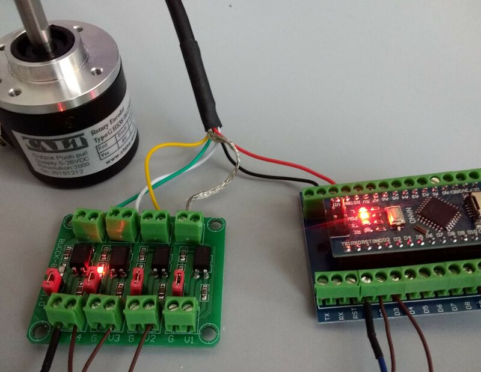

Ardecoder: decoding up to 3 encoder with Arduino Uno or Nano.


ELECTRICAL CONNECTIONS
----------------------

|     |               |
| --- | ------------- |
| D2  | Encoder 1 (A) |
| D3  | Encoder 1 (B) |
| D4  | Encoder 2 (A) |
| D5  | Encoder 2 (B) |
| D6  | Encoder 3 (A) |
| D7  | Encoder 3 (B) |
|     |               |
| D9  | Encoder 1 (Z) |
| D10 | Encoder 2 (Z) |
| D11 | Encoder 3 (Z) |

If fewer encoders are needed, do not connect them. This also works with
incremental encoders without the Z index: in this case the counter will
be set to 0 at startup and never reset.

You can skip any encoder, e.g. you are allowed to connect only encoder 2
and 3 without using encoder 1.



To improve reliability, you can put photocouplers between encoder and
arduino, as shown by the above example where only encoder 1 is connected
(see [the schematic](./ardecoder.pdf) for details). In that case,
remember to consider the maximum speed of the photocoupler too.


HOW DECODING WORKS
------------------

The code keeps the last state of A B phase (`old`) and compares it to
the new state (`now`). Any variation will increase or decrease the
counter (`raw`) depending on a lookup table (`lut`).

If `OVERFLOW` is defined, it is checked if a phase is skipped (e.g. when
the encoder is turning too quickly) by leveraging another lookup table
(`skp`). If that is the case, the counter is incremented or decremented
by 2, depending on the last adjustment.

```
                 _______         _______
        A ______|       |_______|       |______
CCW <--      _______         _______         __  --> CW
        B __|       |_______|       |_______|
```

| now<br>A B | old<br>A B | lut<br>&nbsp; | skp<br>&nbsp;  | |
| --- | --- | ---:|:-----:| ---
| 0 0 | 0 0 |   0 | false |  No movement
| 0 0 | 0 1 |  +1 | false |
| 0 0 | 1 0 |  -1 | false |
| 0 0 | 1 1 |   0 |  true |  One step has been skipped
| 0 1 | 0 0 |  -1 | false |
| 0 1 | 0 1 |   0 | false |  No movement
| 0 1 | 1 0 |   0 |  true |  One step has been skipped
| 0 1 | 1 1 |  +1 | false |
| 1 0 | 0 0 |  +1 | false |
| 1 0 | 0 1 |  -2 |  true |  One step has been skipped
| 1 0 | 1 0 |   0 | false |  No movement
| 1 0 | 1 1 |  -1 | false |
| 1 1 | 0 0 |  +2 |  true |  One step has been skipped
| 1 1 | 0 1 |  -1 | false |
| 1 1 | 1 0 |  +1 | false |
| 1 1 | 1 1 |   0 | false |  No movement

All 4 counters are adjusted according to the above decoding algorithm by
the PCINT2 interrupt handler, called whenever any of the PIND bits (i.e.
any D0..D7 digital input) changes.


PROTOCOL
--------

The communication protocol on the USB bus is text based, so it can be
used it interactively with a serial console. Any request and response is
expected to be newline terminated. Any newline type is accepted: `"\n"`,
`"\r"` or `"\r\n"`. Any response starting with `"#"` is an informational
message and could be safely ignored.

### GET ENCODER DATA

To query an encoder, just send its number (`1`, `2` or `3`) followed by
a newline.

- Example request: `"1\n"`
- Example response: `"1 -581 0 1\r\n"`

The returned fields are respectively:

1. the number of the encoder (`1`, `2` or `3`, the same as the request);
2. the raw counter value;
3. `1` if homed (it passed through the Z phase), `0` otherwise;
4. the number of times a phase was skipped (if `OVERFLOW` is enabled).

### SLAVE OR PUSH MODE

In slave mode (the default), you must manually get the encoder data via
specific queries. For monitoring you must implement by yourself a
polling loop.

In push mode, additionally the encoder data is sent without request
whenever its position changes. The maximum rate of changes (i.e. the
minimum time between two unsolicited responses) is customizable

To enable push mode, use "`S`" followed by the rate time (in
milliseconds) and a newline. To disable push mode and turn back in slave
mode, specify a rate time of 0.

- Request to enable push mode every 0,2 s: `"S200\n"`
- Request to disable push mode: `"S0\n"`


LICENSE
-------

Ardecoder is [MIT licensed](./LICENSE).
